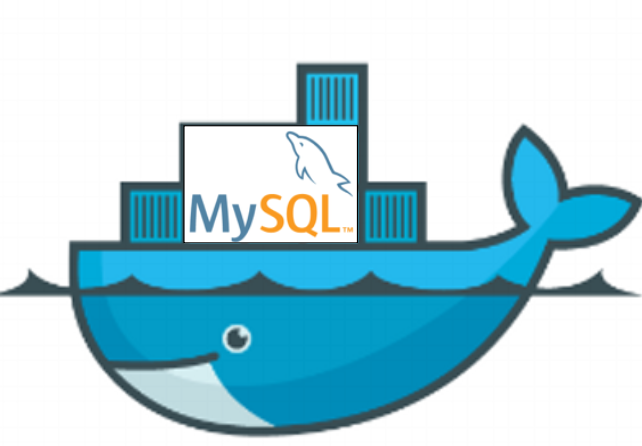

# MySQL Docker Classroom Setup

This repository contains a Dockerfile and initialization SQL script to run a MySQL database pre-populated with the Classicmodels sample dataset. It is designed for teaching and experimentation.

<center></center>

## Requirements

- Docker Desktop installed (Windows, Mac, Linux)
- Basic knowledge of Docker commands
- Install a MySQL client, such as the [DBeaver](https://dbeaver.io/download/) app, or something relevant compatible with your OS.

## Getting Started

1. Clone this repository:
```
git clone https://github.com/captain-bender/mysql-docker-demo.git
cd mysql-docker-demo
```

2. Build the container:
```
docker build -t classicmodels-mysql .
```

3. Run the container (two options)

- Using Docker Compose (recommended):

```powershell
cd C:\Users\capta\OneDrive\Documents\mysql-docker-demo
docker compose up -d --build
```

This builds the image from the `Dockerfile`, creates a named volume for MySQL data, and starts the `mysql-demo` container.

4. Connect to MySQL using your preferred client (e.g., DBeaver). Your database type is MySQL ([figure](./images/pic2.png)), and the connection details are the following ([figure](./images/pic3.png)):
- Host: `localhost`
- Port: `3306`
- User: `root`
- Password: `passwd`
- Database: `classicmodels`

5. Have a look in the [database schema](./MySQL-Sample-Database-Diagram-PDF-A4.pdf) and run sample queries by selecting the SQL tab ([figure](./images/pic1.png)), for example ([figure](./images/pic4.png)):
```
SELECT * FROM customers LIMIT 5;
```
after writing the query, please press play.


## Stopping and cleaning (start from scratch)

If you want to stop the stack and remove all containers, images and data so the next `up` starts from a fresh state, follow the commands below.

- Using Docker Compose: this stops services, removes containers, networks, images that were built by Compose, and deletes named volumes created by the compose file. WARNING: deleting volumes will permanently remove the database contents.

```powershell
cd C:\Users\<your path>\Documents\mysql-docker-demo
docker compose down --rmi all -v --remove-orphans
```

- What the flags do:
	- `--rmi all`: removes images built by Compose (your `classicmodels-mysql` image created by `build`).
	- `-v`: removes named volumes declared in `docker-compose.yml` (this deletes DB data).
	- `--remove-orphans`: removes containers from previous runs that are not defined in this compose file.

## Troubleshooting
- If you get a "Public Key Retrieval is not allowed" error in DBeaver, set `allowPublicKeyRetrieval=true` in the connection properties.
- Make sure Docker Desktop is running and WSL2 is enabled on Windows.

## Credits
- MySQL sample database from [MySQLTutorial](https://www.mysqltutorial.org/getting-started-with-mysql/mysql-sample-database/) website.